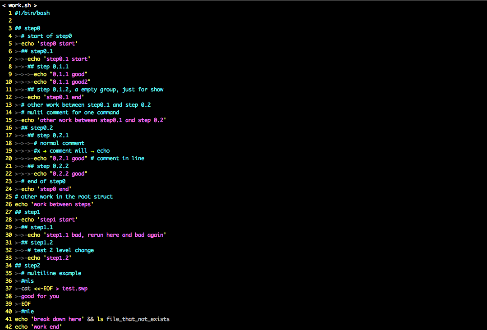

# stepScript
A bash script parser to run bash script in colorful mode.

## functions
1. Code highlights: structure tree in green, comment in blue and input command in yellow
2. In step mode, print command and hit Enter to run it, line by line.
3. Record running state, will skip successful command in last runs.
4. Rerun the code from specific line number, label and command count.

## inspect
### the demo script file
[demo file](./demo/work.sh)

### how stepScript parse the script file

The first tree coloum is "line number|label|command count"
* line number is the line number in the raw script file
* label is the struct label
* command count is the count of running command in the raw script file

So here we have 42 lines, but only 16 command in the raw script
```
"04|1      |  |## step0" means that the "step0" struct has
  has line number 04 in the raw file
  has label "1      "
  no command count (not a command)

"             |  # start of step0" is a comment of code "echo 'step0 start'"

"06|1.1    |01|  echo 'step0 start'" means that the code "echo 'step0 start'"
  has line number 06 in the raw file
  has label "1.1    "
  it is the 01 command in the raw file
```
The script will record its state into ".stepScript.session"
We can control from where we rerun the code using linumber, label and command count
### Usage
say we have the raw script "work.sh"
```shell
$ stepScript work.sh # generate processed script as .work.sh.step.sh
$ bash .work.sh.step.sh -h
usage: .work.sh.step.sh [-hrlncCsSAL:N:C:]
  -h: show this help message
  -r: rerun from the beginning
  -l:       run after label, read from session file
  -L label: run after label
  -n     :  run after line, read from session file
  -N line:  run after line
  -c:       run after code count, read from session file
  -C count: run after code count
  -s: run by steps
  -S: show skipped structures
  -A: show skipped commands and comments
```
you can also generate a easy to use makefile to run this script with all kinds of configure (see examples)
### examples
#### init the project
```shell
$ stepScript work.sh # generate processed script as .work.sh.step.sh
or
$ stepScript --prepare work.sh # generate processed script and makefile
```
#### update the project after modify the raw script
```shell
$ make update # run "stepScript work.sh" to update .work.sh.step.sh
stepScript work.sh
```
#### first run (when you have no .stepScript.session)

we run the script till breakdown
#### rerun from beginning (force rerun from beginning)

#### rerun (rerun from last failed command

we skip good command (by command count, 15 in this example)
#### rerun and show skipped structures

#### rerun and show skipped commands

#### rerun and show all skipped things

#### rerun from last good line number, label or command count (read from session file)
Make sure you understand [how stepScript parse the script](#how-stepscript-understand-the-script-file)

#### rerun from given line number, label or command count
Make sure you understand [how stepScript parse the script](#how-stepscript-understand-the-script-file)

#### step mode (run command by command with ENTER)

#### clean (rm processed script and session file)
```shell
$ make clean
rm .stepScript.session
rm .work.sh.step.sh
```
#### all make commands
```shell
$ make
       update
       show
       rerun
       showStruct
       showCommand
       showAll
       line
       label
       count
       line=
       label=
       count=
       clean
# see the usage in examples above
```
## how to write a script file that can be parsed by stepScript
see the [demo](#the-demo-script-file)
```
1. make indent with "\t"
  reason: if you want to have right multiline string using the
          "cat <<-EOF" syntax within indent code, you must make indent using tab.
2. line startsWith(except for the indent):
  "## ": is a new struct
  "# ": is a normal comment for later command
  "#x ": is a comment that not parsed by stepScript
  "#mls": begin of a multiline command
  "#mle": end of a multiline command
```
## install
```
python setup.py install
```
